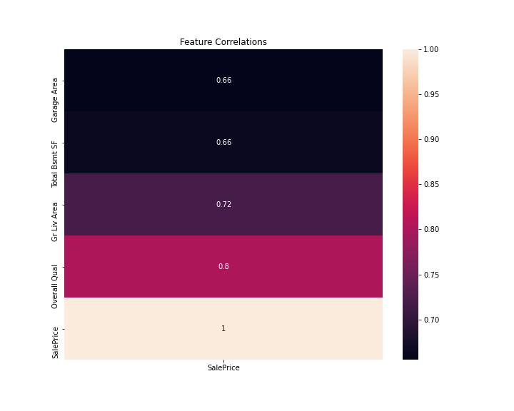
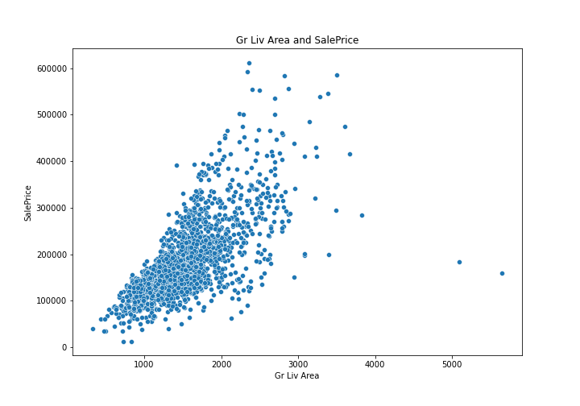
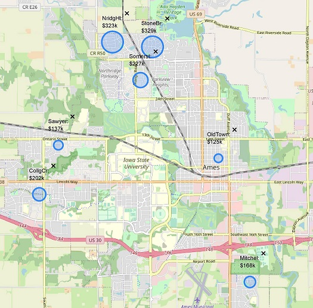
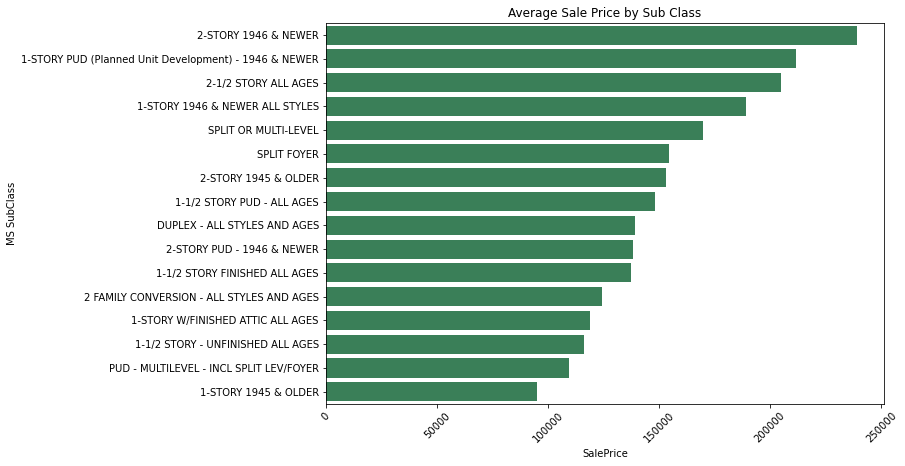
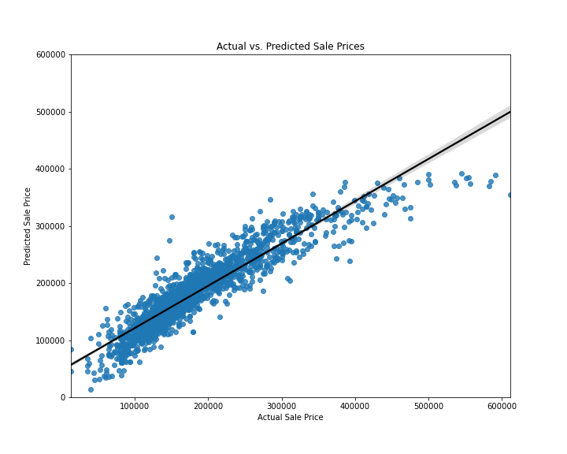

# Predicting Ames Housing Sale Prices
##### by Lindsey Roeder
##### *April 20th 2021*

---

### Problem: 
How can we predict the sale price of homes using collected historical data? 

---

### Executive Summary
To begin my process I sifted through Ames housing data including 2,051 observations and over 70 columns of different features relating to houses. I started by identifying the quantitative features to inspect the correlation to Sale Price. I based my search on most features in the data set. Any columns that had 1000 or more null values were not considered.

Some ordinal data needed to be adjusted from an object to an integer. After converting features I ran tests to see which columns were most correlated and which had the highest significance in a linear model. The winners are the ones shown here: 

In the dataset there are 5 observations with over 4000 square feet. The train data provided to me only included 2 of these outliers, shown below. I tested keeping them in vs removing and found it performed better with the data points taken out. 

Next I looked at qualitative data and decided to use two features: Neighborhood and MS SubClass. I found that each feature had a wide variation when it comes to average sale price. 

Fitting the model required three steps:
1) One Hot Encoder to transform categorical data into quantifiable data. 
2) Standard Scaler in order to standardize features. 
3) Elastic Net estimator to prevent overfitting by adjusting for highly correlated variables and eliminating unnecessay features.

### File Directory

|Feature|Type|Dataset|Description|
|---|---|---|---|
|**README**|*Markdown*|This file is an introduction and description of the project, explaining the process and data. It also includes dictionaries and sources.| 
|**Ames_Presentation**|*PowerPoint*|This file includes the slides from the April 20th presentation.| 
|**1-Code_for_Column_Selection**|*Jupyter Notebook*|This notebook walks through the steps of my feature selection process.| 
|**2-Model_Final**|*Jupyter Notebook*|This notebook includes the creation of my final Kaggle submission model.| 
|**3-Presentation_Model_and_Code**|*Jupyter Notebook*|This notebook was used for adjusting my submission model into a simplified form and to create graphics included in my presentation.| 

---

dtypes: float64(2), int64(3)
### Data Dictionary
The data in this project comes from the Ames, Iowa Assessor’s Office.

|Feature|Type|Description|
|---|---|---|
|**Gr Liv Area**|*integer*|Above grade (ground) living area square feet.| 
|**Overall Qual**|*integer*|Rates the overall material and finish of the house.|
|**Total Bsmt SF**|*float*|Total square feet of basement area.|
|**Garage Area**|*float*|Size of garage in square feet.|
|**Neighborhood**|*object*|Physical locations within Ames city limits.|
|**MS SubClass**|*object*|Identifies the type of dwelling involved in the sale.|
|**SalePrice**|*integer*|Sale price $$.|

---

### Conclusions and Recommendations
On average the model explains 84% of the variance in Sale Price. I found that Greater Living Area and Overall Quality had the highest impacts on increasing the price. My model does better with homes that are sold at under $300k, which accounts for about 92% of the original dataframe. 

---

### Areas for Further Research/Study 
* Adding more features or further transforming the data to better estimate the Sale Price.
* Create features based on the relationships between existing variables.
* Identify the houses on the higher end and treat them with a different model.

---

### Sources
http://www.cityofames.org/assessor/ 
http://jse.amstat.org/v19n3/decock/DataDocumentation.txt 
https://www.cityofames.org/home/showpublisheddocument/1024/637356764775500000 
https://www.forbes.com/sites/trulia/2016/02/19/whats-my-home-worth-9-factors-that-affect-resale-value-2/?sh=552de5343be2

