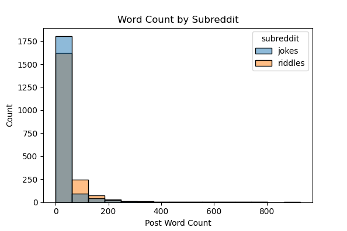
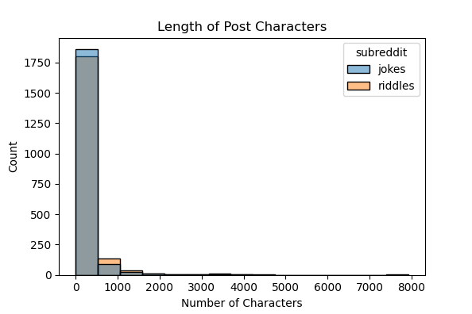
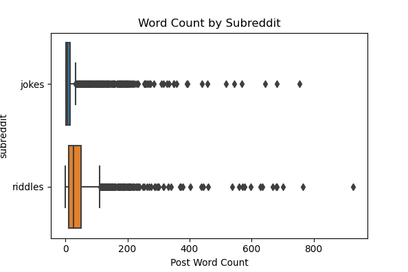
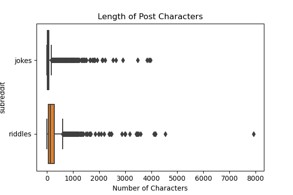
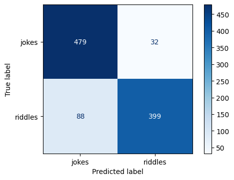
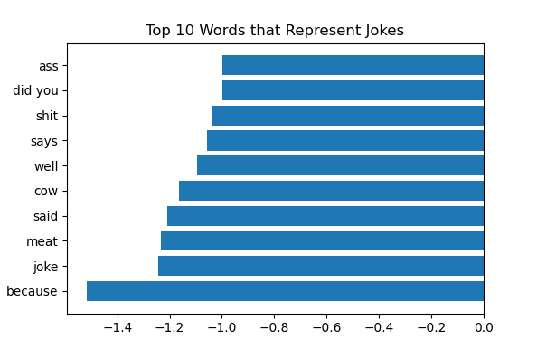
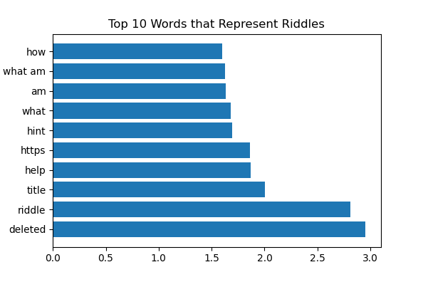

# Project 3: Subreddit Classifier
##### by Lindsey Roeder
##### *May 4th 2021*

---

### Problem: 
Can we create a model to identify which subreddit a post is from?

A classification model will be used to determine the subreddit based on data from each post. Success will be evaluated through metrics such as accuracy, precision, and recall scores. This project is being completed in order to show a class of data science students that NLP can be used to identify the variations in wording of reddit posts.

---

### Executive Summary
I looked to define each of the categories so I could better understand how to classify them. Some similarities are that both are often in the form of a question where one person sets the stage, waits for a response, then delivers a punchline or answer. In the subreddits, they are supposed to be originals that the author comes up with. However, there are differences which allow my model to work: A riddle is more of a game or brain teaser while a joke is designed to cause amusement or laughter. In the subreddits specifically, a riddle won’t tell you the answer and other users are invited to guess in the comments, but jokes will be complete when posted. 

I pulled 2,000 posts from each subreddit. There is an even split between each of the categories, so my baseline accuracy score to improve on is 50%

When diving into r/jokes versus r/riddles, I discovered that the riddles subbreddit uses more words and longer posts on average compared with the jokes subreddit. I dove deeper into the distributions of word count in both categories. They both have a similar distribution as seen in the histograms with over 81% of posts having less than 50 words. The box plots show that there are a lot of outliers when considering word count and length of post. The jokes subreddit goes up to 755 words and 3,962 characters. The riddles subreddit goes up to 926 words and 7,917 characters.

 

 

After testing between the title column and the selftext column, I decided to use the selftext as my X variable. This is the body of the posts and is typically longer than the title in these subreddits. My y variable is the subreddit the post came from - jokes vs riddles. I tried many iterations of my model to find which had the best score:
* Classifiers: Logistic Regression, Naive Bayes, Decision Tree, Gradient Boosting
* Count Vectorizer vs. Tfidf Vectorizer
* Vectorizer Parameters: N_gram range, Stop words, Max Features, and Lemmatization

My best scoring model was Logistic Regression with the following features:
* Lemmatization
* CountVectorizer
    * N_gram: (1, 2)
    * Keep stop words
    * Max Features at 2,500
    
The overall accuracy store on my test set was 88%, which is much higher than the baseline of 50%. The below confusion matrix and table shows that I scored well on classification metrics and had a fairly even amount of false negatives and false positives.

  

    
    
The words with the highest coefficients can be seen below. I think the top 10 words for each subreddit make sense. There are a few profanities in the jokes, which is to be expected. Riddles often end with questions like "What am I?" or "How many are there?" and that is apparent in the bar chart.

 

---

### File Directory

|Feature|Type|Description|
|---|---|---|
|**README**|*Markdown*|This file is an introduction and description of the project, explaining the process and data. It also includes dictionaries and sources.| 
|**redd_presentation**|*PowerPoint*|This file includes the slides from the May 4th presentation.| 
|**reddit_notebook**|*Jupyter Notebook*|This notebook walks through the steps of my model creation and evaluation showing the background coding and notes in markdown cells.| 
|**posts_from_subreddits**|*CSV*|This is the final data file I used to create my model. It is combined from r/jokes and r/riddles subreddits.| 

---

### Conclusions and Recommendations

Overall, I am impressed with the performance of my model and believe the classification metrics prove it is working well. My final Logistic Regression model with Lemmatization and CountVectorizer has proved to be the highest scoring on all metrics.

I have some recommendations I think would improve my model or would be interesting to look into:
* Using both the title and text columns as features would have probably helped my model, but would have taken a very long time.
    * Many of the posts use the title to start the joke or riddle, and the body of the post is only part of it.
* Also pulling the comments would probably really improve the model.

There are a few areas where I think some more data cleaning would have been helpful:
* Some show up as deleted or removed, and it might be beneficial to take them out of the train set.
* A lot of the riddles were links to non-reddit sources. In some ways this helped me identify them as riddles, but it would interesting to see what removing links does.

---

### Sources
Jokes Subreddit:
https://www.reddit.com/r/Jokes/

Riddles Subreddit:
https://www.reddit.com/r/riddles/