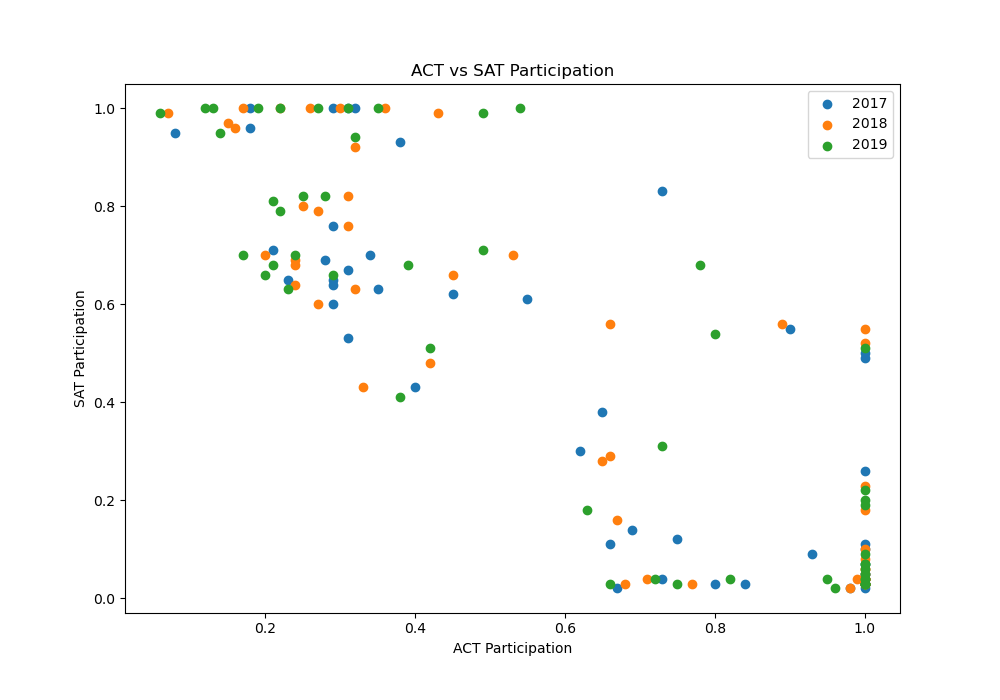
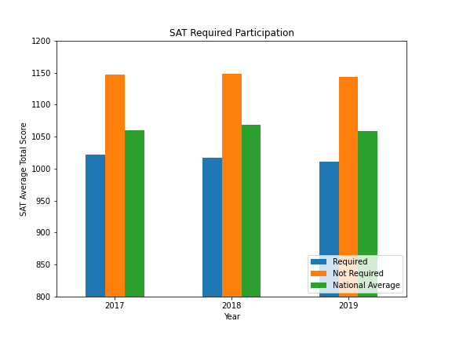
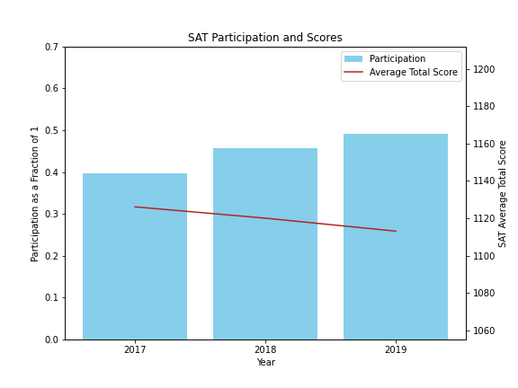
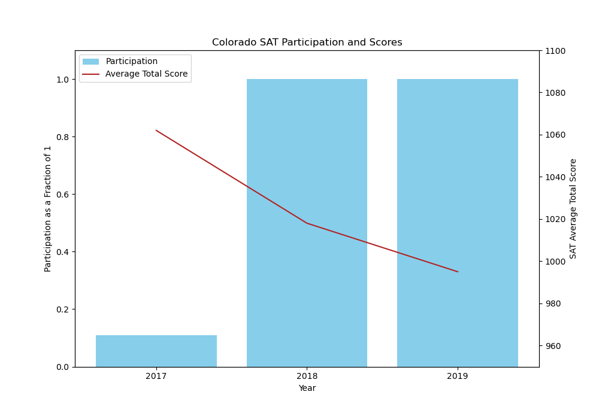

# Improving SAT Participation Rates
##### by Lindsey Roeder
##### *April 6th 2021*

---

### Problem: 
How can we increase the SAT participation rate across the country? 
Is there a way to gain more confidence from school boards and students?

---

### Executive Summary
To begin my process I sifted through three years (2017-2019) of score and participation data for both the SATs and ACTs. I found that generally the participation for both tests had an inverse correlation, meaning that states that favored the SAT often had low ACT participation and vice versa. The scatter plot below shows this relationship:

When diving into the scores versus participation, I also found an inverse correlation for both tests. Higher participation equals lower average scores in the state, as shown in the graphs below. 

 

I zoomed in on a few states that recently made the switch to requiring SATs to show this relationship: Rhode Island, West Virginia, and Colorado. See a chart for Colorado below as an example:

In order to address our problem, I saw two ways to improve our reputation and raise participation rates
* First, help students better prepare for the test. One of Colorado's main reasons for beginning to require the SATs (when they had previously required ACTs) was our test prep. This can help fix the concern states may have about decreasing SAT scores when mandating the test to graduate. 
* Second, make the test more accessible to everyone. We can help by offering SAT School Days in more counties and states in order to give students an easier and free way to take our test. 

The next state I believe we should target is Missouri. I recommend this because it has historically been drawn to the ACT, it has a high SAT score naturally, and has a large population that can hopefully have an big impact on our national participation rate.

---

### File Directory

|Feature|Type|Dataset|Description|
|---|---|---|---|
|**README**|*Markdown*|This file is an introduction and description of the project, explaining the process and data. It also includes dictionaries and sources.| 
|**SAT and ACT Findings**|*PowerPoint*|This file includes the slides from the April 6th presentation.| 
|**SAT-and-ACT-Findings-Code**|*Jupyter Notebook*|This notebook walks through the steps of my analysis showing the background coding and notes in markdown cells.| 
|**Total_Scores**|*CSV*|This is the final data file I used to conduct my analysis. It is combined from various year and test information cited below.| 

---

### Data Dictionary
The data in this project comes from various sources provided by College Board, ACT.org, College Vine blog posts or PrepScholar.com.

|Feature|Type|Dataset|Description|
|---|---|---|---|
|**state**|*object*|ACT/SAT|The list of states in the study, includes all 50 states plus Washington DC.| 
|**sat17_participation**|*float*|SAT 2017|The 2017 SAT participation rate by state (shown as a fraction of 1).|
|**sat17_total**|*integer*|SAT 2017|The 2017 SAT average Total combined (sum of Math and Evidence-Based Reading and Writing) score by state.|
|**act17_participation**|*float*|ACT 2017|The 2017 ACT participation rate by state (shown as a fraction of 1).|
|**act17_composite**|*float*|ACT 2017|The 2017 ACT average Composite score by state. The Composite score is the average of your the test scores, rounded to the nearest whole number.|
|**sat18_participation**|*float*|SAT 2018|The 2018 SAT participation rate by state (shown as a fraction of 1).|
|**sat18_total**|*integer*|SAT 2018|The 2018 SAT average Total combined (sum of Math and Evidence-Based Reading and Writing) score by state.|
|**act18_participation**|*float*|ACT 2018|The 2018 ACT participation rate by state (shown as a fraction of 1).|
|**act18_composite**|*float*|ACT 2018|The 2018 ACT average Composite score by state. The Composite score is the average of your the test scores, rounded to the nearest whole number.|
|**sat19_participation**|*float*|SAT 2019|The 2019 SAT participation rate by state (shown as a fraction of 1).|
|**sat19_total**|*integer*|SAT 2019|The 2019 SAT average Total combined (sum of Math and Evidence-Based Reading and Writing) score by state.|
|**act19_participation**|*float*|ACT 2019|The 2019 ACT participation rate by state (shown as a fraction of 1).|
|**act19_composite**|*float*|ACT 2019|The 2019 ACT average Composite score by state. The Composite score is the average of your the test scores, rounded to the nearest whole number.|

---

### Conclusions and Recommendations
I recommend two main strategies:
* Continue to offer, evaluate, and improve free online SAT prep. 
* Make SAT Day more widespread by providing funding and organization efforts.

The first state to target with this strategy should be Missouri.

---

### Areas for Further Research/Study 
What to look into next in order to complete the decision:
* How effective is the Khan Academy online program and what changes are needed for it to have a higher success rate?
* Which states have a trend of colleges no longer requiring standardized testing? Does it make sense to market there?

---

### Sources
SAT Data:  
https://blog.collegevine.com/here-are-the-average-sat-scores-by-state/ 
https://blog.prepscholar.com/average-sat-scores-by-state-most-recent 
 
SAT National Averages: 
https://reports.collegeboard.org/pdf/2017-total-group-sat-suite-assessments-annual-report.pdf 
https://reports.collegeboard.org/pdf/2018-total-group-sat-suite-assessments-annual-report.pdf#page=4&zoom=auto,-63,775 
https://reports.collegeboard.org/pdf/2019-total-group-sat-suite-assessments-annual-report.pdf#page=4&zoom=100,-142,725 
 
SAT State Specific Information: 
https://blog.prepscholar.com/which-states-require-the-sat 
https://reports.collegeboard.org/archive/sat-suite-program-results/2018/sat-school-day 
https://www.coloradokids.org/wp-content/uploads/2016/01/ACTvsSAT_FINAL.pdf 
 
ACT Data:  
https://www.act.org/content/dam/act/unsecured/documents/cccr2017/ACT_2017-Average_Scores_by_State.pdf 
https://www.act.org/content/dam/act/unsecured/documents/cccr2018/Average-Scores-by-State.pdf 
https://www.act.org/content/dam/act/secured/documents/cccr-2019/Average-Scores-by-State.pdf 
 
ACT State Specific Information: 
https://magoosh.com/hs/sat/states-that-require-the-act-or-sat/ 
